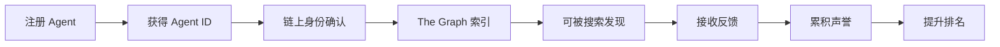

# ERC-8004 + x402 集成实现总结

## ✅ 已完成的工作

### 1. 核心代码实现

#### 📁 合约接口和类型定义
- **文件**: `src/erc8004/contracts.ts`
- **内容**:
  - IdentityRegistry 合约 ABI
  - ReputationRegistry 合约 ABI
  - 合约地址配置（Sepolia, Mainnet, Base）
  - TypeScript 类型定义（Agent, Feedback, ReputationScore等）

#### 📁 The Graph 客户端
- **文件**: `src/erc8004/graph-client.ts`
- **功能**:
  - 查询所有已注册 agents
  - 根据 ID 查询单个 agent
  - 搜索 agents（关键词、标签、能力、评分筛选）
  - 获取 agent 反馈列表
  - 获取热门 agents
  - 获取平台统计数据

#### 📁 ERC-8004 服务层
- **文件**: `src/erc8004/erc8004-service.ts`
- **功能**:
  - 注册新 AI Agent
  - 更新 Agent 元数据
  - 提交反馈/评分
  - 获取 Agent 信息
  - 获取声誉分数
  - 搜索和查询功能
  - 集成 The Graph 查询

#### 📁 事件监听器
- **文件**: `src/erc8004/event-listener.ts`
- **功能**:
  - 监听 NewRegistration 事件
  - 监听 MetadataUpdated 事件
  - 监听 NewFeedback 事件
  - 获取历史事件
  - 实时更新本地缓存

### 2. HTTP API 端点

#### 📁 API 路由
- **文件**: `api/erc8004.ts`
- **端点**:
  - `GET /api/erc8004?action=search` - 搜索 agents（免费）
  - `GET /api/erc8004?action=trending` - 获取热门 agents（免费）
  - `GET /api/erc8004?action=agent&id=X` - 获取 agent 详情（免费）
  - `GET /api/erc8004?action=feedbacks` - 获取反馈（基础免费，高级付费）
  - `GET /api/erc8004?action=stats` - 平台统计（免费）
  - `POST /api/erc8004?action=register` - 注册 agent（链上交易）
  - `POST /api/erc8004?action=submit-feedback` - 提交反馈（链上交易）

### 3. MCP 工具集成

#### 📁 主服务器
- **文件**: `src/index.ts`
- **新增工具**:
  1. `erc8004_register_agent` - 注册 AI Agent
  2. `erc8004_search_agents` - 搜索 Agents
  3. `erc8004_get_agent` - 获取 Agent 详情
  4. `erc8004_submit_feedback` - 提交反馈
  5. `erc8004_get_trending` - 获取热门 Agents
  6. `erc8004_get_stats` - 获取平台统计

### 4. 数据库设计

#### 📁 Schema
- **文件**: `src/erc8004/database-schema.sql`
- **表结构**:
  - `erc8004_agents` - Agents 信息
  - `erc8004_feedbacks` - 反馈记录
  - `erc8004_event_logs` - 事件日志
  - `erc8004_search_stats` - 搜索统计
- **视图**:
  - `erc8004_agents_with_reputation` - 带声誉的 Agents
  - `erc8004_trending_agents` - 热门 Agents
- **索引**: 优化查询性能的多个索引

### 5. 文档和示例

#### 📁 完整指南
- **文件**: `ERC8004_INTEGRATION_GUIDE.md`
- **内容**: 详细的集成指南、架构设计、变现路径

#### 📁 快速开始
- **文件**: `ERC8004_QUICKSTART.md`
- **内容**: 5分钟快速上手教程

#### 📁 代码示例
- **文件**: `examples/erc8004-example.ts`
- **内容**: 完整的使用示例代码

#### 📁 README 更新
- **文件**: `README.md`
- **内容**: 添加了 ERC-8004 功能说明

### 6. 配置文件更新

#### 📁 环境变量
- **文件**: `.env.example`
- **新增**:
  - `X402_WALLET_PRIVATE_KEY` - 钱包私钥
  - `ERC8004_NETWORK` - 网络选择
  - `THEGRAPH_SUBGRAPH_URL` - Subgraph URL

#### 📁 Package.json
- **文件**: `package.json`
- **更新**:
  - 新增依赖: graphql, graphql-request
  - 新增脚本: `example:erc8004`
  - 更新 keywords

## 📊 项目结构

```
x402-mcp-server/
├── src/
│   ├── erc8004/                      # ERC-8004 模块
│   │   ├── contracts.ts              # 合约 ABI 和类型
│   │   ├── graph-client.ts           # The Graph 客户端
│   │   ├── erc8004-service.ts        # 服务层
│   │   ├── event-listener.ts         # 事件监听器
│   │   └── database-schema.sql       # 数据库 Schema
│   ├── index.ts                      # 主 MCP 服务器（已更新）
│   └── ...
├── api/
│   ├── erc8004.ts                    # ERC-8004 HTTP API
│   └── ...
├── examples/
│   ├── erc8004-example.ts            # 使用示例
│   └── ...
├── ERC8004_INTEGRATION_GUIDE.md      # 完整集成指南
├── ERC8004_QUICKSTART.md             # 快速开始指南
├── ERC8004_IMPLEMENTATION_SUMMARY.md # 本文档
├── README.md                         # 已更新
├── package.json                      # 已更新
└── .env.example                      # 已更新
```

## 🎯 核心功能

### Agent 生命周期管理



### 数据流设计

```
用户操作 → MCP/HTTP API → ERC8004Service → 链上合约
                                    ↓
                            EventListener 监听
                                    ↓
                            更新本地数据库
                                    ↓
                            The Graph 索引
                                    ↓
                            GraphClient 查询
```

### x402 支付集成

```
基础功能（免费）:
├── 注册 Agent
├── 基础搜索（≤20 结果）
├── 查看 Agent 详情
└── 获取反馈（≤10 条）

高级功能（x402 付费）:
├── 高级搜索（>20 结果）
├── 批量查询
├── 历史数据导出
└── 详细分析报告
```

## 🚀 快速开始

### 1. 安装依赖

```bash
npm install
```

### 2. 配置环境

```bash
cp .env.example .env
# 编辑 .env，添加私钥和 RPC URL
```

### 3. 使用 MCP 工具

在 Claude Desktop 中：

```
请帮我注册一个 AI Agent，
名称: My Trading Bot
描述: 自动化交易助手
能力: trading, market-analysis
```

### 4. 使用 HTTP API

```bash
# 搜索
curl "https://your-api.vercel.app/api/erc8004?action=search&keyword=trading"

# 获取热门
curl "https://your-api.vercel.app/api/erc8004?action=trending&limit=10"
```

### 5. 运行示例代码

```bash
npm run example:erc8004
```

## 💰 变现策略

### 免费层
- ✅ 基础搜索和查询
- ✅ Agent 注册
- ✅ 提交反馈

### 付费层（x402）
- 💰 高级搜索 - 0.0001 ETH/次
- 💰 批量查询 - 0.0005 ETH/次
- 💰 数据导出 - 0.001 ETH/次
- 💰 详细报告 - 0.005 ETH/次

### 订阅层
- 💎 无限访问 - 0.01 ETH/月
- 💎 高级功能 - 0.01 ETH/月
- 💎 实时通知 - 0.005 ETH/月

## 🔗 合约地址

### Sepolia 测试网
```
IdentityRegistry:   0x8004A818BFB912233c491871b3d84c89A494BD9e
ReputationRegistry: 0x8004B663056A597Dffe9eCcC1965A193B7388713
```

### 主网
待部署...

## 📖 技术栈

- **区块链**: Ethereum, Base, Sepolia
- **智能合约**: ERC-8004 标准
- **支付协议**: x402
- **索引**: The Graph
- **数据库**: PostgreSQL
- **前端**: MCP + HTTP API
- **开发**: TypeScript, viem, graphql

## 🛠️ 下一步开发

### 短期（1-2 周）
- [ ] 完善 x402 支付验证
- [ ] 优化 The Graph 查询
- [ ] 添加缓存层
- [ ] 性能优化

### 中期（3-4 周）
- [ ] 前端 UI 开发
- [ ] WebSocket 实时通知
- [ ] 高级筛选功能
- [ ] 分析仪表板

### 长期（5+ 周）
- [ ] 主网部署
- [ ] 移动端支持
- [ ] AI 推荐算法
- [ ] 社区治理

## 📚 资源链接

- [ERC-8004 官方规范](https://eips.ethereum.org/EIPS/eip-8004)
- [ERC-8004 官网](https://8004.org)
- [x402 官网](https://www.x402.org)
- [The Graph 文档](https://thegraph.com/docs)
- [Viem 文档](https://viem.sh)

## 🎉 总结

我们成功地将 **ERC-8004 AI Agent 身份和声誉管理**与 **x402 支付协议**完美集成，创建了一个功能完整的 AI Agent 发现和交互平台。

### 核心优势

1. **去中心化** - 所有身份和声誉数据都在链上，不可篡改
2. **可发现性** - 通过 The Graph 索引，快速搜索和发现 Agents
3. **可变现** - 使用 x402 为高级功能收费
4. **易集成** - 提供 MCP 和 HTTP API 两种接口
5. **可扩展** - 模块化设计，易于添加新功能

### 开始使用

阅读 [快速开始指南](./ERC8004_QUICKSTART.md) 或 [完整集成指南](./ERC8004_INTEGRATION_GUIDE.md) 立即开始！

---

**由 Claude Code 生成** 🤖
基于 ERC-8004 + x402 标准构建
2026年2月
